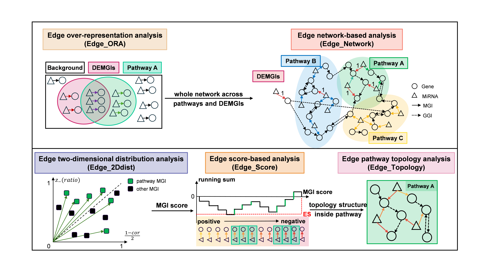

# miREA: a network-based tool for edge-based microRNA-oriented enrichment analysis
[](https://zenodo.org/records/18803209)

We present miRNA-oriented Enrichment Analysis (**miREA**) framework, which integrates miRNA–gene interaction (**MGI**) networks with miRNA and gene transcriptomic data to improve functional interpretation of miRNAs.

miREA is designed to address the intrinsic many-to-many regulatory interactions of MGIs and reduce biases introduced by conventional node-centric enrichment aprroaches, by explicitly modeling **miRNA-gene regulatory networks**, **pathway topology**, and **expression-informed MGI edge scores**.


---

## Key Features

* miREA leverages **MGI** for network-based pathway enrichment analysis.
* miREA designs **MGI scores** to characterize regulatory strengths of MGIs.
* miREA implements **five edge-based methods** spanning over-representation, scoring-based, topology-aware, and network propagation approaches.
* The edge-based methods **outperform** node-based methods in sensitivity and biological interpretability.
* miREA elucidates **miRNA-gene-pathway regulatory mechanisms** in bladder cancer.

---

## Usage
miREA is implemented in R. Required R packages include (but may not be limited to):
* dplyr (1.14), tidyr (1.3.1), tidyverse (2.0.0), stringr (1.5.1), conflicted (1.2.0), igraph (2.1.4), V8 (6.0.1), data.table (1.16.4), Matrix (1.7.2), parallel (4.4.2), reticulate (1.40.0), ComplexHeatmap (2.22.0), RColorBrewer (1.1.3), grid (4.4.2), circlize (0.4.16), gridExtra (2.3), patchwork (1.3.0), scales (1.3.0), tibble (3.2.1), ggalluvial (0.12.5), ggplot2 (3.5.1), ggnewscale (0.5.0), colorspace (2.1.1), reshape2 (1.4.4)

Please follow the following steps to run miREA for enrichment analysis:

*Please refer to ```analysis/4_case_study/example.R``` as a detailed example for cancer hallmarks enrichment based on bladder urothelial carcinoma data.*
1. Load all functions in R/ and library packages needed.
   ```r
   setwd("[directory of miREA]") # set working directory
   load(function.RData) # it contains all functions included in the R/. You could also source .R files you need in the R/.
   source(R/lib.R)
   ```
2. Prepare raw data that will be used as input for getting miREA input data (see details at ```get_all_input_data()``` function).
   ```r
   # example
   methods <- default.method_list
   pathway <- read.csv("data/raw_data/pathway/hallmark/hallmark_gene.csv", header = TRUE)
   mir_DEdata <- read.csv(paste0("data/raw_data/cancer_data/DEmiR/", cancer, "_DEmiR.csv"))
   gene_DEdata <- read.csv(paste0("data/raw_data/cancer_data/DEG/", cancer, "_DEG.csv"))
   mir_DEdata <- mir_DEdata %>% select(miRNA, log2FoldChange, stat, padj)
   gene_DEdata <- gene_DEdata %>% select(gene, log2FoldChange, stat, padj)
   load("data/raw_data/background/background_MGI.RData")
   background_GGI = NULL
   GGI_source = "Omnipath"
   gene_mat <- read.csv(paste0("data/raw_data/cancer_data/paired/", cancer, "_gene_TP.csv"), header = TRUE, check.names = FALSE)
   mir_mat <- read.csv(paste0("data/raw_data/cancer_data/paired/", cancer, "_mir_TP.csv"), header = TRUE, check.names = FALSE)
   scoreFun = "rank"
   ```
3. **Generate input data**: run ```get_all_input_data()``` to generate *a list named input_data*, which is required as input for miREA.
   ```r
   input_data <- get_all_input_data(methods, pathway, mir_DEdata, gene_DEdata, background_MGI, background_GGI, GGI_source, gene_mat, mir_mat, scoreFun)
   ```
4. **Enrichment analysis**: run ```miREA()``` to conduct enrichment analysis under predefined methods, which returns to *a list named result*, containing enrichment results for all selected methods.
   ```r
   result <- miREA(methods, input_data, background, minSize, maxSize, pvalueType, pAdjMethod, pvalueCutoff, iter, ncores)
   ```
5. **Visualization**: run ```plot_summary()```, ```plot_heatmap()```, ```plot_heatmap_sankey()``` to get PDF plots, which will be save at plot_path you specified.
   ```r
   summary_plot <- plot_summary(result, penrichCutoff, plot_path, fill_col)
   ht_plot <- plot_heatmap(method, result, input_data, n_mir_heatmap, n_pathway, plot_path, penrichCutoff, height, width, gene_annot, mir_annot, annot_color)
   ht_sankey_plot <- plot_heatmap_sankey(method, result, input_data, n_mir_heatmap, n_mir_sankey, n_pathway, plot_path, penrichCutoff, height, width, sankey_prop, gene_annot, mir_annot, annot_color)
   ```

---

## Output

miREA returns results containing:

* a list named input_data for the input data of miREA.
* a list named result for the enrichment result, including parameters, valid methods, time for different methods, and results containing a dataframe for each approach.
* visualization pdf plots for methods comparison, and heatmap-sankey plot for each approach to discovery miRNA-gene-pathway regulatory mechanisms.

All raw data, processed data, and original results for the various cancer types and pathway sets have been deposited at [](https://zenodo.org/records/18803209).

---

## Repository Structure

```
miREA/
├── mapping.docx       # For easy reference, it includes the correspondence between sections, plots, tables in the article and the current repository.
├── Figure1.png        # Illustration of five edge-based methods

├── function.RData     # all functions for miREA, integrating functions in R/
├── R/                 # all R functions
├── Javascript/        # Javascript codes for estimating p-values for permutation test

├── data/ 
  ├── raw_data/
    ├── background/    # global miRNA-gene interaction and gene-gene interaction background
    ├── cancer_data/   # raw data needed for enrichment (only include BLCA for example)
      ├── DEG/         # gene differential expression analysis result
      ├── DEmiR/       # miRNA differential expression analysis result
      └── paired/      # gene and miRNA expression profiles and paired information
    └── pathway/       # three predefined pathway sets: Reactome, cancer hallmark, and cancer-specific pathways
  ├── input_data/      # input data generated from get_all_input_data() function
  └── cancer_list/     # cancer-related genes and miRNAs

├── results/           # enrichment results (only include BLCA for example)

├── analysis/          # codes, results, and plots generated for analysis
  ├── 2.1_positive_benchmark 
  ├── 2.2_negative_benchmark 
  ├── 2.3_distinguish_ability
  ├── 2.4_cancer_identify_ability
  ├── 2.5_robustness 
  ├── 2.6_data_source 
  ├── 2.7_time_test
  ├── 3_methods_performance_summary
  └── 4_case_study

└── README.md
```

---

## Citation

---

## Contact

